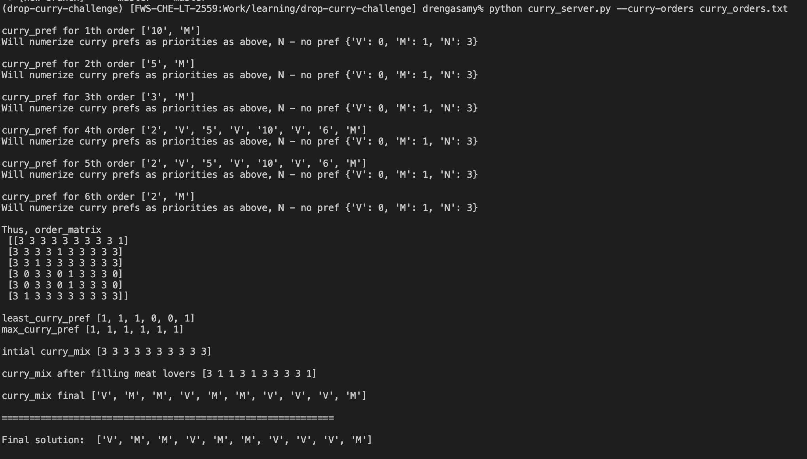

# curry-mix

A CLI application in python that enables to prepare a curry mix based on curry order file

To use the application,

1. Run 'pip install pipenv' if you don't have already
2. Run 'pipenv shell'
3. Run 'pipenv install'
4. Run 'python curry_server.py --curry-orders curry_orders.txt'

